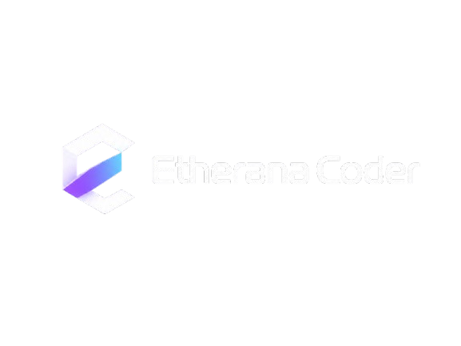

# Etherana Coder

	
	
<strong>The open-source AI IDE by GoAnon</strong>

	
<a href="https://goanon.pro">goanon.pro</a>

---

Etherana Coder is an open-source, AI-integrated IDE built for developers who want full control over their models and their data. Use AI agents on your codebase, track and visualize changes before they're applied, and connect any model — cloud or local — without your code ever leaving your machine.

## Features

- **AI Agents** — Autonomous agents handle complex, multi-file tasks across your entire codebase.
- **Project Memory** — Persistent local context so the AI understands your project's architecture across sessions.
- **Checkpointing** — Every AI-driven change is tracked and shown as a diff before it's applied. Accept or reject at any granularity.
- **Universal Model Support** — Connect to any provider or run models locally. No lock-in.
- **Privacy First** — Messages go directly to your chosen provider. No intermediate server, no data retention by Etherana.

## Supported Providers

**Cloud:** Anthropic, OpenAI, Google Gemini, DeepSeek, Groq, Mistral, Grok (xAI), OpenRouter, Google Vertex AI, Microsoft Azure OpenAI, AWS Bedrock

**Local / self-hosted:** Ollama, LM Studio, vLLM, LiteLLM, any OpenAI-compatible endpoint

## Getting Started

Download the latest release from the [Releases](../../releases) page, open it, and follow the onboarding steps to configure your preferred AI provider.

## Telemetry

Etherana collects basic anonymous usage analytics (via PostHog) to help us understand how the product is being used — things like which providers are configured, agent loop completions, and whether the app is running. **No code, prompts, or AI responses are ever collected.**

You can opt out at any time in **Settings → Etherana → Disable Telemetry**.

## Building from Source

Etherana Coder is a fork of [Void Editor](https://github.com/voideditor/void), which is itself a fork of [VS Code](https://github.com/microsoft/vscode). The build process follows the same steps as Void.

**Prerequisites vary by platform:**

- **macOS** — Python and Xcode (usually pre-installed)
- **Windows** — [Visual Studio 2022](https://visualstudio.microsoft.com/) with `Desktop development with C++` and `Node.js build tools` workloads
- **Linux (Debian/Ubuntu)** — `sudo apt-get install build-essential g++ libx11-dev libxkbfile-dev libsecret-1-dev libkrb5-dev python-is-python3`

**Steps:**

1. `git clone https://github.com/GoAnonTools/Etherana-Coder`
2. `npm install`
3. Open the repo in VS Code or Etherana and press `Cmd+Shift+B` (Mac) / `Ctrl+Shift+B` (Windows/Linux) to start the build — it's done when 2 of 3 spinners turn to check marks.
4. Run the dev window:
   - Mac/Linux: `./scripts/code.sh`
   - Windows: `./scripts/code.bat`
5. Press `Cmd+R` / `Ctrl+R` inside the dev window to reload after making changes.

> Make sure you're on Node `20.18.2` (see `.nvmrc`). Use [nvm](https://github.com/nvm-sh/nvm) to switch: `nvm install && nvm use`.

For a guide to the codebase, see [ETHERANA_CODEBASE_GUIDE.md](./ETHERANA_CODEBASE_GUIDE.md).

## Contributing

See [HOW_TO_CONTRIBUTE.md](./HOW_TO_CONTRIBUTE.md) for contribution guidelines.

## Credits

Etherana Coder is developed and maintained by **[GoAnon](https://goanon.pro)**.

Built on top of:
- [Void Editor](https://github.com/voideditor/void) — open-source AI IDE (Apache 2.0)
- [VS Code](https://github.com/microsoft/vscode) — open-source editor by Microsoft (MIT)

## License

Etherana's additions and modifications are licensed under the **Apache License 2.0**. See [LICENSE.md](./LICENSE.md).

The underlying VS Code source is licensed under the **MIT License**. See [LICENSE-VS-Code.txt](./LICENSE-VS-Code.txt).
